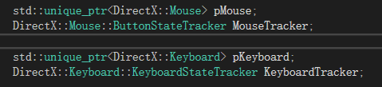
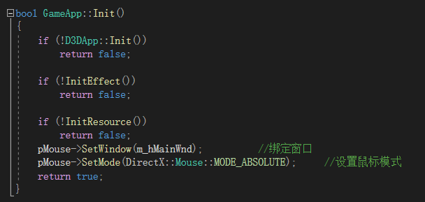
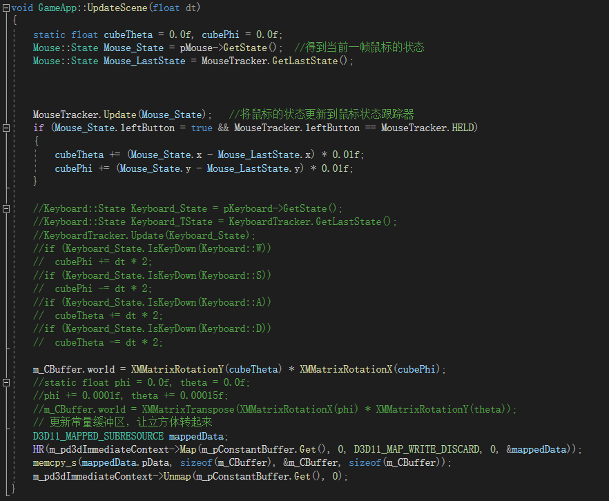
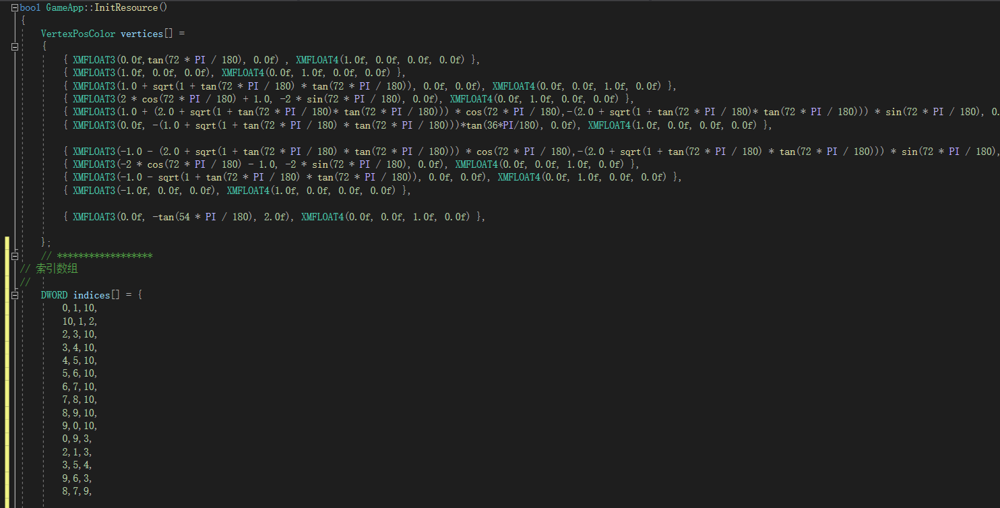
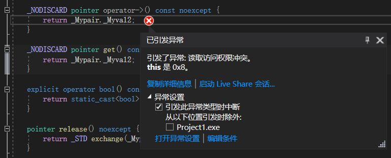

## 小组第三次作业文档

#### 一、作业要求                                                                    

​	1.创建五角星棱柱

​	2.实现键鼠响应

#### 二、实现分析

​	1.画好五角星的草图，计算各点与绘图顺序

​	2.查阅博客，了解键鼠代码实现

#### 三、所学的大致归纳

​	关于键鼠大致思路：

要实现鼠标的使用需要先三步：1.先在d3dAPP.h中实例化出Mouse（鼠标），MouseTrack（鼠标跟踪）的指针，并使用智能指针。2.在GameApp中初始化阶段初始化上述鼠标（Mouse）指针。3.在d3dApp.cpp文件中修改回调函数。        完成后在GameApp.cpp中声明两个State类型变量（一个记录当前鼠标状态，另一个记录上一帧鼠标状态），并调用上述两个指针的函数赋值，之后再更新MouseTracker的状态。按照需求实现鼠标的操作对应一定的变化

实现键盘的使用：类似于实现鼠标，先实现键盘的使用：1.实例化出Keyboard与KeyboardStateTracker的指针（根据有无初始化的函数再进行初始化）2.在d3dApp.cpp文件中修改回调函数。    完成后同上，声明变量，更新状态，根据需求输入变换的代码

（详细的修改与代码写在笔记或查阅博客）

#### 四、代码实现

​	d3dApp.h

​	

GameApp.cpp

(键盘响应存在bug，已注释)

（五角星的绘制）

##### 实现结果

### 五、存在问题与解决

​	问题1.绘制出的五角星出现空隙。分析：所绘制的五角星不是正五角星。解决方法：重新计算

​	问题2.完成键盘代码后无法执行，在运算符重载函数中报错。     

                           分析：可能是有关键盘指针的初始化，描述存在缺漏，导致调用pKeyboard->GetState()函数时出现指针访问问题。 尝试解决：重看博客查找是否有遗漏信息，没有则对比例子的代码，寻找是否有代码缺漏。                                                     再次分析：鼠标指针也使用相应运算符与调用相应函数，但不存在问题。可能是有关键盘相应文件的问题。             因对框架仍不熟悉，未果。          

### 六、参考文献                                                            

​	X_Jun博客