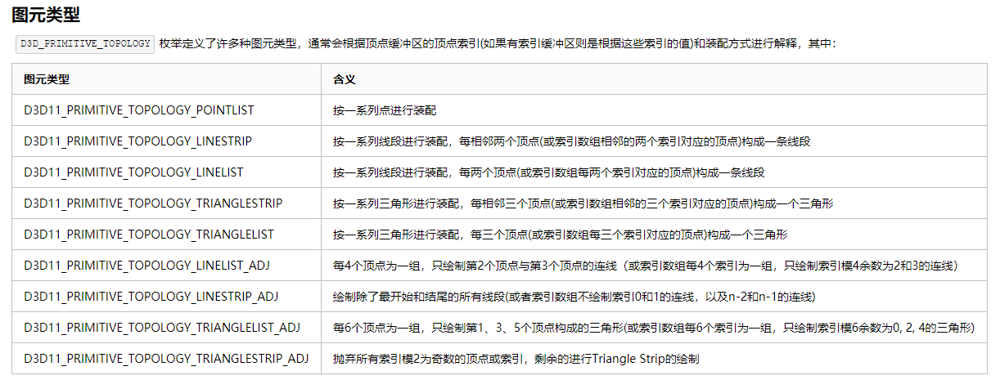
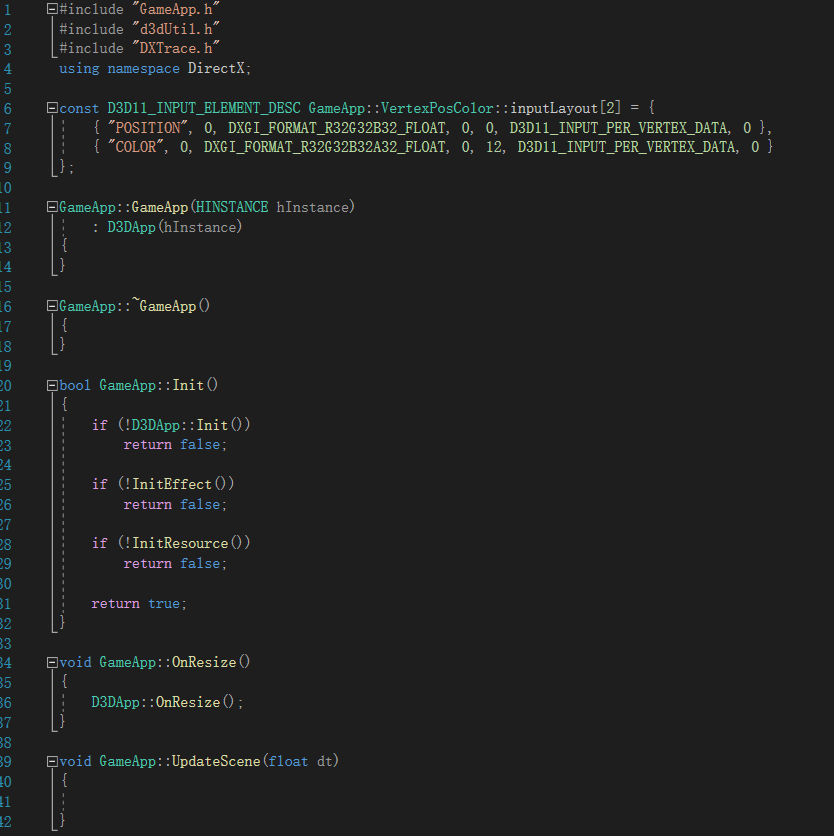
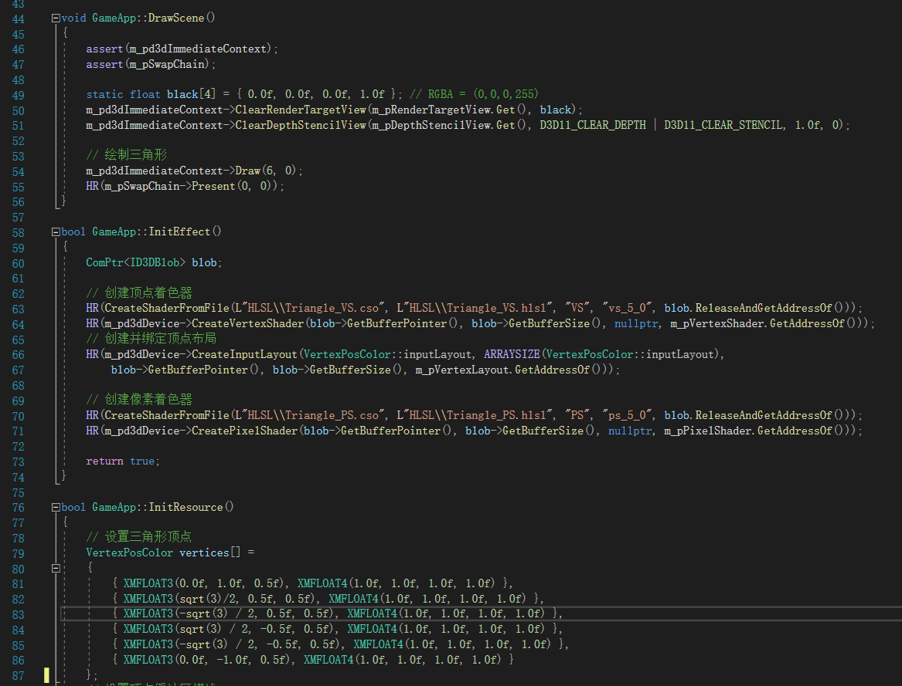
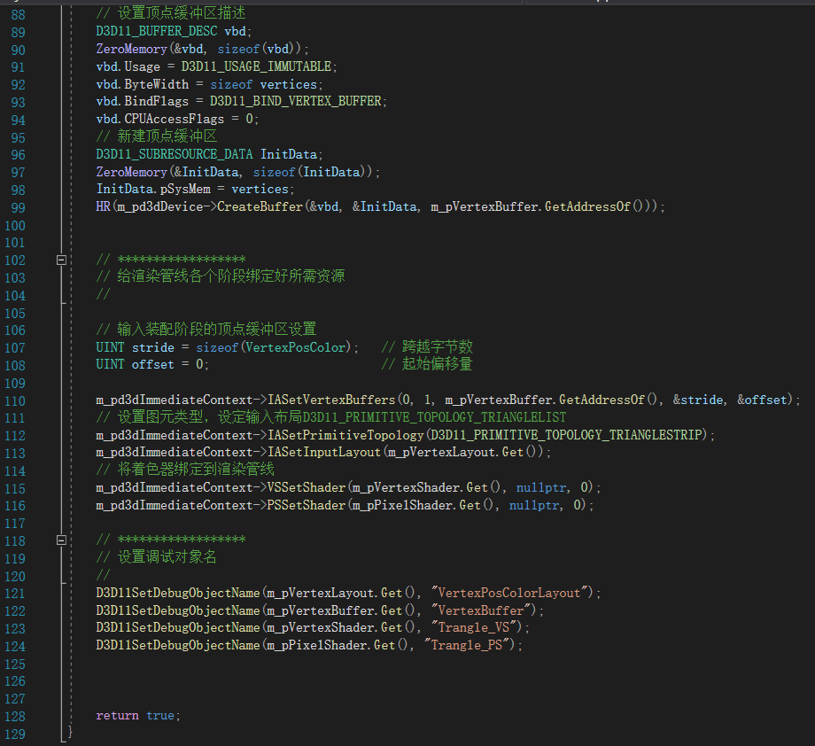
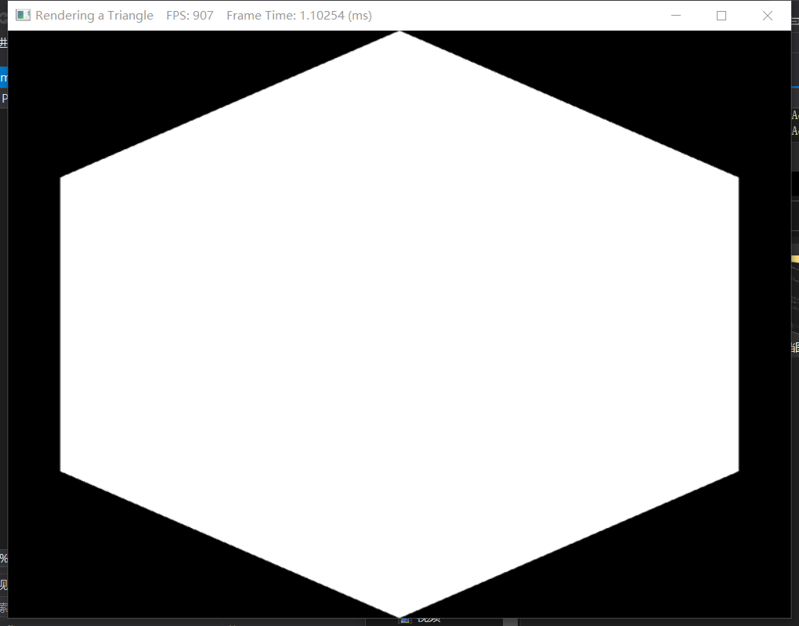
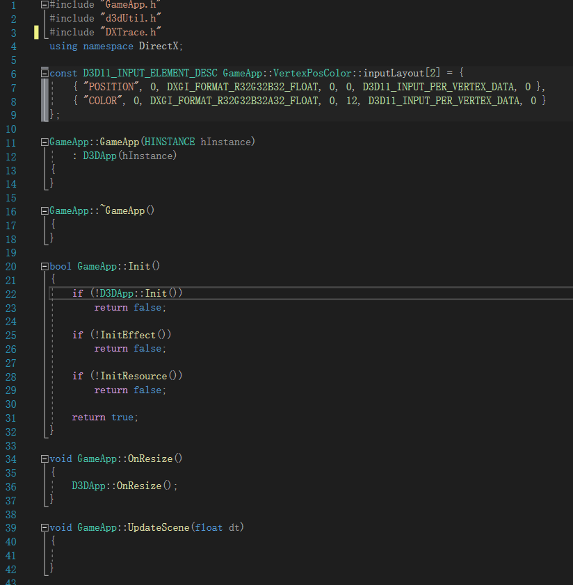
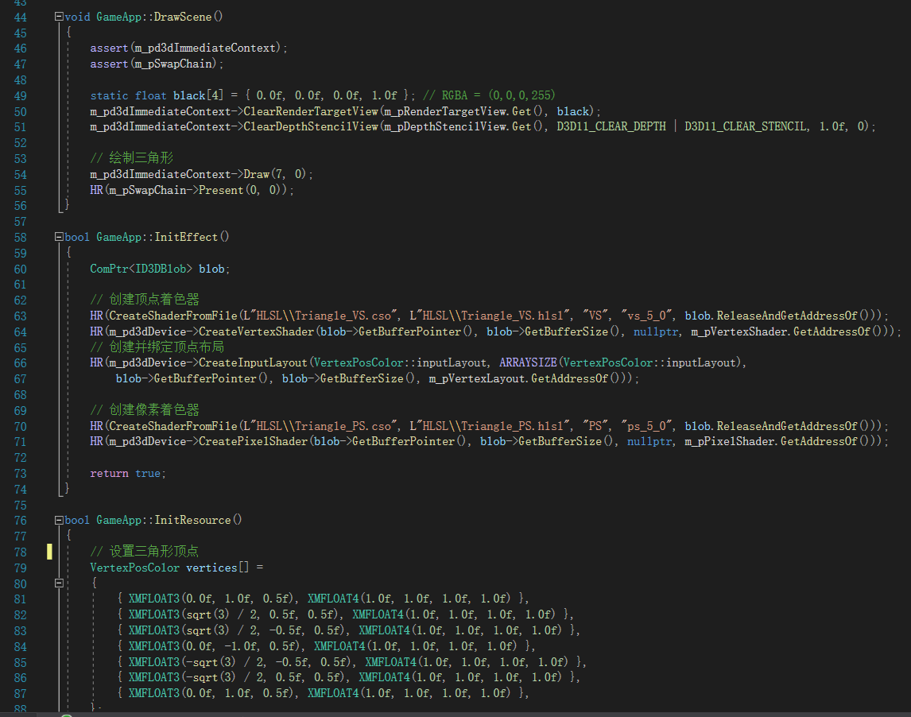
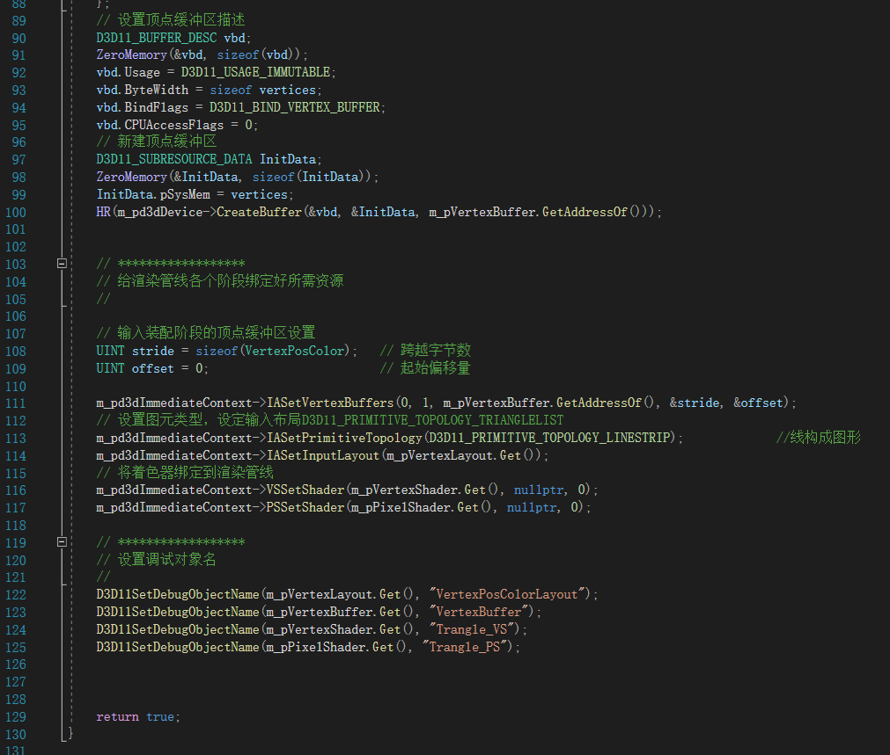
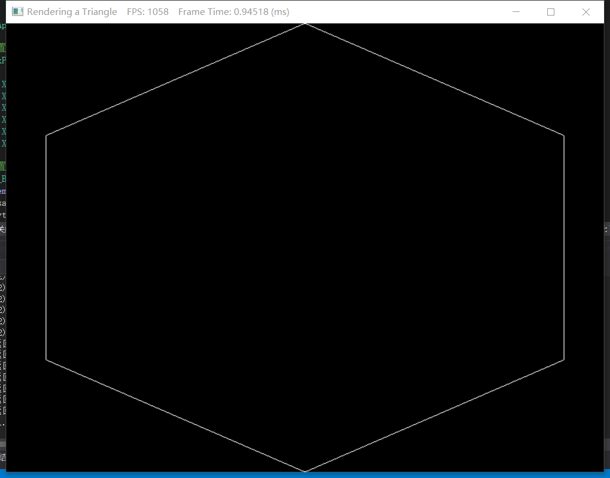

## 																小组作业二   文档

### 一丶作业目的：

​	1.初步了解渲染管线

​	2.了解顶点着色器和像素着色器

​	3.了解HLSL编译着色器方法与绑定到渲染管线上的代码实现

​	4.了解顶点缓冲区

​	5.用两种方法渲染出一个等六边形

### 二丶作业要求

​	学习要求：完成作业目的中的理论学习

​	 代码要求：找到对应的代码进行适当的修改，实现出一个等六边形

### 三丶实现分析

​		阅读博客，大致了解重要代码

​		通过修改图元类型以改变六边形的方法

### 四丶代码实现（渲染出等六边形）			

​	方法一（拼凑法）：

​				实现代码

​			图形结果：				

​	方法二（连线法）：

​				实现代码

​				实现结果

### 五丶体会，总结

##### 	一.存在问题与解决方法

​		问题1：实现拼凑法中出现了半边渲染情况。分析：顶点存储时无规律，导致出现顶点逆时针排布，构成背面消隐。解决方法：草图决定好顶点顺序，重新排列。

##### 	二.学习过程与体会

​		本人先完成完成六边形的渲染，初用复杂的框架，选择在查看博客时寻找关键的代码，最终定位在Draw（）函数，顶点代码所在位置，图元类型代码这三处位置，进行修改完成六边形。期间在X_Jun的博客中背面消隐没有得到对顶点设置很好的理解，导致出现问题，后来通过询问他人和观看其它有关博客下解决。

​		类似于以往学cocos2d，开始对复杂的框架代码陌生迷茫，但这次有比以往较好的语言基础，能阅读大部分的代码。初碰这种较大的框架，博客的语言与代码中（我至今所见）较复杂的逻辑，再加上专业的术语（如字节码，字节偏移量等），感觉对此感到晦涩难懂。在第二篇文章来回翻阅，才有了大致的了解。

​		通过本次初步对复杂陌生框架的接触，再次确认了所学的语言只是基础，以后的学习是直接以引擎框架为起点，面向搜索引擎——有关博客，手册的查找是主要学习路径

### 六丶参考文献

​		X_Jun等博主博客